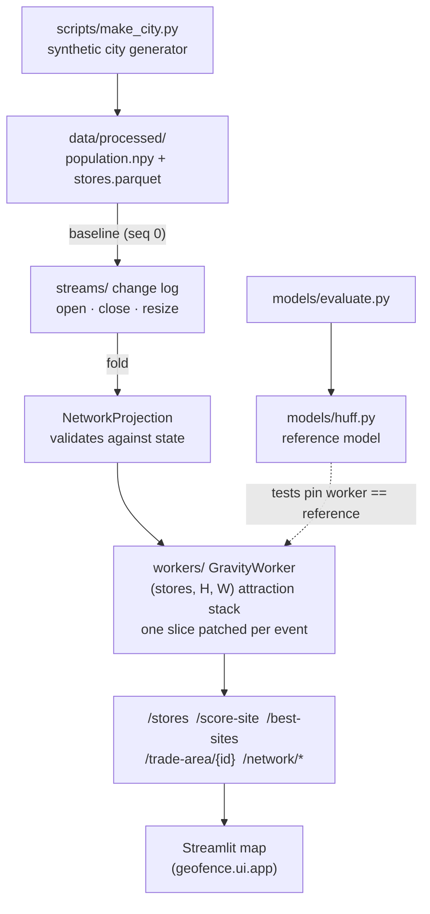

<div align="center">


</div>

# GeoFence — Spatial Retail Gravity & Catchment Area Optimization

**Where should the next store go — and the one after that?** GeoFence models how a population chooses between competing retail locations using the **Huff gravity model**, scores candidate sites by the demand they would *actually* win net of what they cannibalize from stores you already own, and plans multi-store expansions against a **live store network** that you open, close and refit through an event log. It runs on a synthetic city grid, exposes its analysis over a FastAPI service, and ships with an interactive Streamlit map.

<div align="center">

[](https://www.python.org/)
[](https://fastapi.tiangolo.com/)
[](https://pytest.org/)
[](https://opensource.org/licenses/MIT)

</div>

---

## The problem

Retail site selection is not "find the busiest corner." A busy corner may already be blanketed by your own stores, so a new outlet there mostly reshuffles existing customers rather than winning new ones. The number that matters is **net-new demand**: the customers a site captures *minus* the customers it steals from your current network (its **cannibalization**).

There is a second trap once you have that number. A ranked list of candidate sites scores every site against the *same* network, so the top five entries can all be the best answer to the same underserved pocket. Open them together and they split that pocket between them; the sum of their individual scores is fiction. GeoFence makes both trade-offs explicit: it scores single sites honestly, and it plans expansions one store at a time, re-scoring the map after each opening.

## What it does

- **Store performance** — captured demand and demand share for every store in the current network.
- **Site scoring** — for a hypothetical new store, its captured demand, how much it cannibalizes from existing stores, and the net-new result.
- **Best-site search** — sweeps candidate cells across the grid and ranks them by net-new demand.
- **Live network** — open, close and resize stores through a journaled event log; every endpoint scores against the network as it now stands, and each event comes back with what it did to demand (a closure reports how much of its demand other stores reabsorb and how much is left uncovered).
- **Sequential rollout** — plans an *n*-store expansion by greedy re-sweeps and reports, side by side, how badly the static top-*n* list would have overcounted.
- **Trade areas** — a store's dominant catchment (cells where it wins a majority share) and a drive-time isochrone.

## How it works



The synthetic city is built with a **deliberately over-served downtown**: roughly half the stores cluster in the densest centre, leaving secondary population hotspots underserved. That planted structure is what makes cannibalization matter — and what both the evaluation script and the rollout planner expose.

## The gravity model

The Huff model gives the probability that the population in grid cell $i = (x, y)$ shops at store $j$:

$$P_{ij} = \frac{S_j^{\alpha} / d_{ij}^{\beta}}{\sum_{k} S_k^{\alpha} / d_{ik}^{\beta}}$$

where $S_j$ is store floor area (sqm), $d_{ij}$ is the Euclidean cell-to-store distance (with a small intra-cell offset so a store's own cell isn't zero-distance), $\alpha$ weights store size, and $\beta$ is distance friction. Attraction is zeroed beyond a maximum service radius. Defaults (`configs/config.yaml`): $\alpha = 1.0$, $\beta = 2.0$, radius $= 12$ cells. Captured demand for a store is $\sum_i P_{ij} \cdot \text{Pop}_i$.

**Cannibalization** falls straight out of the same math. To score a candidate site, GeoFence recomputes patronage shares with the candidate added to the network, then compares:

$$\text{net-new} = \underbrace{\sum_i P_{i,\text{cand}} \cdot \text{Pop}_i}_{\text{candidate capture}} - \underbrace{\sum_{j \in \text{existing}} \big(D^{\text{before}}_j - D^{\text{after}}_j\big)}_{\text{cannibalized from existing}}$$

### What net-new actually measures

Demand in this model is inelastic: every cell inside at least one store's radius spends all of its population somewhere. Adding a store to an already-covered cell only moves shares around, so within covered cells capture and cannibalization cancel exactly. Net-new demand therefore collapses to **the population inside the candidate's radius that no store reached before** — the test suite pins this to within rounding. Two consequences worth knowing before you trust a ranking:

- A candidate's floor area changes its capture and its cannibalization rate but **never its net-new demand**; $\alpha$ and $\beta$ do not affect the net-new ranking either.
- Net-new is only ever coverage. Once the whole grid is covered, every further store is 100% cannibalization and the rollout planner stops.

### Two implementations of the same math

- **`models/huff.py`** — the pandas/NumPy reference model. Readable, rebuilds every store's attraction map on each call. Used by `models/evaluate.py` and as the oracle the tests compare against.
- **`workers/processor.py`** — the `GravityWorker` that powers the API. It keeps the `(stores, H, W)` attraction stack in memory and patches exactly one slice per open/close/resize, so scoring a candidate against the live network is one extra map plus a couple of array reductions. On the default 40×40 city it produces the identical top-*k* to the reference model in 0.029 s instead of 0.998 s for the 324-candidate sweep (`uv run python scripts/rollout_benchmark.py`).
- **`kernels/`** — a vectorized Structure-of-Arrays reimplementation (`SpatialStoreGrid`, 3D broadcasts) with its own defaults, exercised by `tests/test_vectorized_kernels.py`; it is not wired into the service.

## The live network

The store table the API serves is not read from disk on every call. `data/processed/stores.parquet` is the baseline (sequence 0); everything after that is an event in an append-only log (`streams/producer.py`), folded into the current state by a projection (`streams/consumer.py`) that validates each event against the network as it stands and hands it to the gravity worker.

| Event | Needs | Comes back with |
|---|---|---|
| `open` | `x`, `y`, `size_sqm` (store id auto-assigned if omitted) | the site score it was opened on: capture, cannibalized, net-new |
| `close` | `store_id` | demand released, how much other stores reabsorb, how much is left uncovered |
| `resize` | `store_id`, `size_sqm` | the store's demand before and after, i.e. what it takes from its neighbours |

Every outcome also carries network demand before and after. A malformed event (unknown kind, `open` without coordinates, a zero-sized `resize`) is refused with **422** before it touches anything. A well-formed event that makes no sense for the current network (closing a store that isn't there, opening a duplicate id, a site off the grid) is still journaled — it is part of the network's history — but marked **rejected** with a reason and answered **409**; the state does not move and the id counter is not bumped. `POST /network/reset` drops the log and returns to the generated city.

The log is in-memory: it lives as long as the API process. That is deliberate for a modelling tool — you try a plan, look at it, reset — and it is the honest limit of what this ships.

### Sequential rollout

`POST /network/rollout {"n_stores": 3}` opens the best net-new site on a copy of the network, re-sweeps, opens the next, and so on. It returns each step's marginal net-new (these are exact, so they add up to the realised network gain), and alongside it what the static top-*n* of a single sweep *claims* versus what it would *realise* if those sites were opened together. With `"commit": true` the plan is written to the log as `open` events.

On the default city (`uv run python scripts/rollout_benchmark.py --k 3`):

```
static top-3 of one sweep:
  (   8,  32) net-new   35,464.0
  (  10,  30) net-new   35,439.6
  (  10,  32) net-new   35,294.2
  claimed (sum of scores)    106,197.8
  realised opened together    36,044.7  overcount 194.6%

greedy sequential rollout (3 re-sweeps):
  1. (   8,  32) net-new   35,464.0  cannibalization 38%  cumulative 35,464.0
  2. (   8,  10) net-new   17,142.5  cannibalization 42%  cumulative 52,606.5
  3. (   8,   2) net-new      593.8  cannibalization 92%  cumulative 53,200.3
  realised     53,200.3  (+47.6% vs static batch)
```

All three "best sites" are the same north-west pocket two cells apart; opened together they realise a third of what their scores add up to. `--k 5` makes the point harder: the top-5 list claims 175,900 and realises the same 36,045, an overcount of 388%, while the sequential plan's third, fourth and fifth stores each add under 600 — the city is essentially covered after two openings, and the planner says so instead of listing five more sites.

Greedy sequential planning is not optimal in general (a batch of two complementary sites can beat greedy's second pick), but its numbers are additive and its stopping rule is honest, which the static list's are not.

## Getting started

```bash
make install                       # uv sync --group dev

uv run python scripts/make_city.py # generate the synthetic city (required first)

make api                           # FastAPI on http://localhost:8290
make ui                            # Streamlit map on http://localhost:8791
```

The API needs the generated city: endpoints return **503** until `scripts/make_city.py` has written `data/processed/population.npy` and `stores.parquet`. The UI reads `GEOFENCE_API_URL` (the `make ui` target points it at `http://localhost:8290`). In the UI you can score a cell, open a store there, watch the expansion plan re-solve, commit it, and reset.

Or with Docker:

```bash
make docker-up                     # docker compose up --build -d  (API :8290, UI :8791)
make docker-down
```

### Change the network from a shell

```bash
curl -X POST localhost:8290/network/events -H 'content-type: application/json' \
     -d '{"kind":"open","x":8,"y":32,"size_sqm":1200}'
curl -X POST localhost:8290/network/events -H 'content-type: application/json' \
     -d '{"kind":"close","store_id":3}'
curl localhost:8290/network/events          # the log, each entry with its outcome
curl -X POST localhost:8290/network/rollout -H 'content-type: application/json' -d '{"n_stores":3}'
```

### Score a site directly

```python
import numpy as np
from geofence.kernels import SpatialStoreGrid, evaluate_site_placement_kernel

pop = np.load("data/processed/population.npy")
stores = SpatialStoreGrid(
    store_ids=np.array([1, 2, 3]),
    x_coords=np.array([12.0, 25.0, 18.0]),
    y_coords=np.array([15.0, 30.0, 12.0]),
    size_sqm=np.array([1500.0, 2400.0, 1800.0]),
)
result = evaluate_site_placement_kernel(
    candidate_x=22.0, candidate_y=18.0, candidate_size=2000.0,
    pop_grid=pop, existing_stores=stores,
)
print(result.as_dict())
```

`OptimalSiteResult.as_dict()` returns `best_coord`, `size_sqm`, `total_captured`, `cannibalized`, `net_new_demand`, and `cannibalization_rate`. (Values depend entirely on your synthetic city and store layout — this is an illustrative call, not a benchmark.)

## API

| Method | Route | Purpose |
|---|---|---|
| `GET`  | `/health` | Liveness check |
| `GET`  | `/stores` | Current network with captured demand and demand share |
| `POST` | `/score-site` | Score a candidate `{x, y, size_sqm}` against the current network |
| `GET`  | `/best-sites?top_k=8` | Top-*k* of one sweep by net-new demand (not a batch to open together) |
| `GET`  | `/trade-area/{store_id}?minutes=15&threshold=0.5` | Drive-time isochrone + majority-share catchment |
| `GET`  | `/heatmap` | Raw population grid + store coordinates (used by the UI) |
| `GET`  | `/network` | Sequence number, store count, applied/rejected counts, network demand, coverage |
| `GET`  | `/network/events?after_seq=0` | The change log, each event with its outcome |
| `POST` | `/network/events` | Open / close / resize a store; 200 applied, 409 rejected (still journaled), 422 malformed |
| `POST` | `/network/rollout` | `{n_stores, size_sqm?, commit?}` — sequential plan vs static top-*n* |
| `POST` | `/network/reset` | Drop the log, return to the generated city |

## Evaluation

The point isn't a headline accuracy number — it's showing that a cannibalization-aware pick beats a capture-greedy one on a city that is already over-served downtown. `models/evaluate.py` sweeps every candidate site with the reference model and reports two picks side by side:

- **capture-greedy** — the site with the highest raw captured demand.
- **cannibalization-aware** — the site with the highest net-new demand.

It logs both sites' net-new demand and cannibalization rates, the net-new uplift between them, and the fraction of population already covered — all to an MLflow run. To reproduce:

```bash
uv run python -m geofence.models.evaluate   # prints and logs the placement metrics
make mlflow                                 # MLflow UI on http://localhost:5030
```

The rollout numbers quoted above come from `scripts/rollout_benchmark.py`; both scripts read whatever `scripts/make_city.py` last wrote, so regenerate the city with a different seed and the numbers move.

## Testing

```bash
make test                                   # uv run pytest --cov
```

- `test_geofence.py` — Huff invariants (patronage conserves covered population), cannibalization ordering by proximity, best-site ranking, isochrone growth, and the API contract.
- `test_network_events.py` — event contracts refuse malformed events; the log's sequence numbers and cursor reads; the incremental worker matches `models/huff.py` to 1e-9 after a burst of opens/closes/resizes; net-new equals newly covered population and is independent of store size; rejected events are journaled without moving state; closing a store reports exactly the population it alone reached (two rim cells in the fixture city — that one caught the author's own wrong expectation); the static top-*k* overcounts while sequential marginals add up; the planner stops when the grid is fully covered.
- `test_vectorized_kernels.py` — tensor shapes and probability invariants for the vectorized kernels, plus the capture/cannibalization/net-new decomposition.

## Limitations

- **Distance is straight-line, not road network.** The "drive-time" isochrone is Euclidean distance at a flat assumed speed, not real routing.
- **Demand is inelastic and coverage-bounded.** Total demand inside the service radius is fixed, so net-new demand is purely coverage expansion (see *What net-new actually measures*). A new store never grows the market.
- **Synthetic data only.** The city, population, and stores are generated; $\alpha$, $\beta$, and the service radius would need calibration against real footfall or transaction data.
- **The change log is in-process memory.** It resets when the API restarts and is not shared between replicas; there is no broker behind it.
- **Greedy rollout, not optimal.** The planner is a sequential greedy heuristic; it does not search over batches.
- **Grid-scale.** Everything runs on a small in-memory grid (default 40&times;40); it is a modelling demo, not a large-scale GIS engine.

## Project structure

```
src/geofence/
├── models/     # Huff reference model (huff.py) + placement benchmark (evaluate.py)
├── workers/    # GravityWorker: incremental attraction stack, scoring, sweep, rollout planner
├── streams/    # network change log: event contracts, append-only journal, projection
├── kernels/    # Vectorized Structure-of-Arrays reimplementation (spatial.py, types.py)
├── api/        # FastAPI app (main:app) and routes
├── ui/         # Streamlit map, site scorer, network controls, expansion plan
└── settings.py # env + configs/config.yaml loader
scripts/make_city.py          # synthetic city generator (run before the API)
scripts/rollout_benchmark.py  # static top-k vs sequential rollout + sweep timing
configs/config.yaml           # grid size, gravity params, placement sweep
```

## License

MIT

---

<div align="center">

**Jackson Marcus** · Senior AI & Machine Learning Engineer

[](https://github.com/jackson-marcus)
[](mailto:wajahatanees41@gmail.com)

</div>
