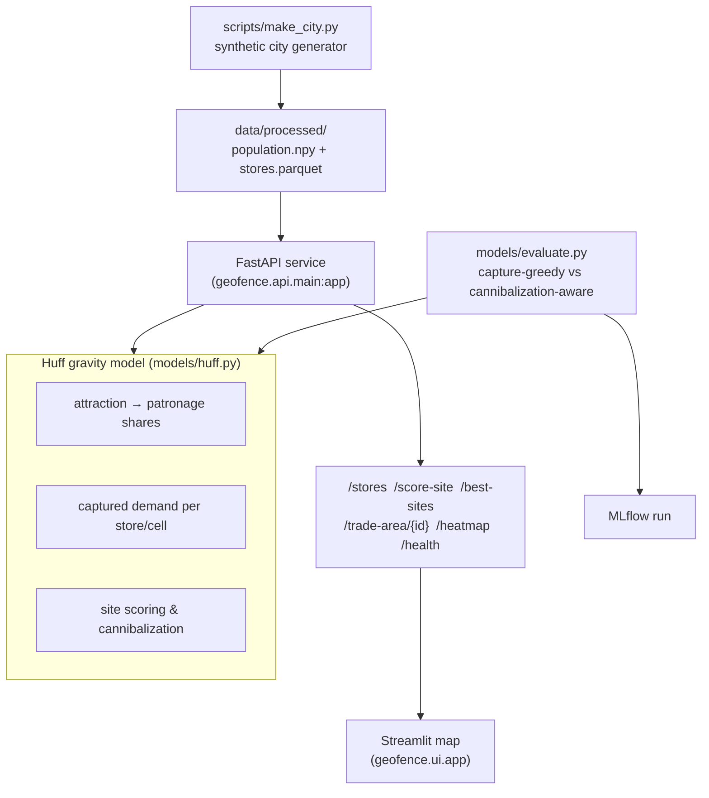

<div align="center">


</div>

# GeoFence — Spatial Retail Gravity & Catchment Area Optimization

**Where should the next store go?** GeoFence models how a population chooses between competing retail locations using the **Huff gravity model**, then scores candidate sites by the demand they would *actually* win — net of the demand they cannibalize from stores you already own. It runs on a synthetic city grid, exposes its analysis over a FastAPI service, and ships with an interactive Streamlit map.

<div align="center">

[](https://www.python.org/)
[](https://fastapi.tiangolo.com/)
[](https://pytest.org/)
[](https://opensource.org/licenses/MIT)

</div>

> **Portfolio project.** Built to demonstrate spatial modelling and a clean data/API/UI split on synthetic data. Not hardened for production use.

---

## The problem

Retail site selection is not "find the busiest corner." A busy corner may already be blanketed by your own stores, so a new outlet there mostly reshuffles existing customers rather than winning new ones. The number that matters is **net-new demand**: the customers a site captures *minus* the customers it steals from your current network (its **cannibalization**).

GeoFence makes that trade-off explicit. Given a population map and a set of existing stores, it estimates the probability that each neighbourhood shops at each store, converts those probabilities into captured demand, and evaluates any candidate site — or sweeps the whole map — ranking locations by net-new demand instead of raw capture.

## What it does

- **Store performance** — captured demand and demand share for every existing store.
- **Site scoring** — for a hypothetical new store, its captured demand, how much it cannibalizes from existing stores, and the net-new result.
- **Best-site search** — sweeps candidate cells across the grid and ranks them by net-new demand.
- **Trade areas** — a store's dominant catchment (cells where it wins a majority share) and a drive-time isochrone.

## How it works

The pipeline is a straight line: generate a synthetic city, serve the gravity model over HTTP, visualize it in the browser.



The synthetic city is built with a **deliberately over-served downtown**: roughly half the stores cluster in the densest centre, leaving secondary population hotspots underserved. That planted structure is what makes cannibalization matter — and what the evaluation script measures.

## The gravity model

The Huff model gives the probability that the population in grid cell $i = (x, y)$ shops at store $j$:

$$P_{ij} = \frac{S_j^{\alpha} / d_{ij}^{\beta}}{\sum_{k} S_k^{\alpha} / d_{ik}^{\beta}}$$

where $S_j$ is store floor area (sqm), $d_{ij}$ is the Euclidean cell-to-store distance (with a small intra-cell offset so a store's own cell isn't zero-distance), $\alpha$ weights store size, and $\beta$ is distance friction. Attraction is zeroed beyond a maximum service radius. Defaults (`configs/config.yaml`): $\alpha = 1.0$, $\beta = 2.0$, radius $= 12$ cells. Captured demand for a store is $\sum_i P_{ij} \cdot \text{Pop}_i$.

**Cannibalization** falls straight out of the same math. To score a candidate site, GeoFence recomputes patronage shares with the candidate added to the network, then compares:

$$\text{net-new} = \underbrace{\sum_i P_{i,\text{cand}} \cdot \text{Pop}_i}_{\text{candidate capture}} - \underbrace{\sum_{j \in \text{existing}} \max\!\big(0,\, D^{\text{before}}_j - D^{\text{after}}_j\big)}_{\text{cannibalized from existing}}$$

### Two implementations of the same math

- **`models/huff.py`** — the pandas/NumPy reference model that powers the API and Streamlit app. Readable, per-store loops over the grid.
- **`kernels/`** — a vectorized reimplementation using a **Structure-of-Arrays** store layout (`SpatialStoreGrid`) and 3D `(stores, height, width)` NumPy broadcasts, so distance, attraction, patronage, and site evaluation each run as a single tensor operation with no Python object per cell. Exercised directly by the test suite.

## Getting started

```bash
make install                       # uv sync --group dev

uv run python scripts/make_city.py # generate the synthetic city (required first)

make api                           # FastAPI on http://localhost:8290
make ui                            # Streamlit map on http://localhost:8791
```

The API needs the generated city: endpoints return **503** until `scripts/make_city.py` has written `data/processed/population.npy` and `stores.parquet`. The UI reads `GEOFENCE_API_URL` (the `make ui` target points it at `http://localhost:8290`).

Or with Docker:

```bash
make docker-up                     # docker compose up --build -d  (API :8290, UI :8791)
make docker-down
```

### Score a site directly

```python
import numpy as np
from geofence.kernels import SpatialStoreGrid, evaluate_site_placement_kernel

pop = np.load("data/processed/population.npy")
stores = SpatialStoreGrid(
    store_ids=np.array([1, 2, 3]),
    x_coords=np.array([12.0, 25.0, 18.0]),
    y_coords=np.array([15.0, 30.0, 12.0]),
    size_sqm=np.array([1500.0, 2400.0, 1800.0]),
)
result = evaluate_site_placement_kernel(
    candidate_x=22.0, candidate_y=18.0, candidate_size=2000.0,
    pop_grid=pop, existing_stores=stores,
)
print(result.as_dict())
```

`OptimalSiteResult.as_dict()` returns `best_coord`, `size_sqm`, `total_captured`, `cannibalized`, `net_new_demand`, and `cannibalization_rate`. (Values depend entirely on your synthetic city and store layout — this is an illustrative call, not a benchmark.)

## API

| Method | Route | Purpose |
|---|---|---|
| `GET`  | `/health` | Liveness check |
| `GET`  | `/stores` | Existing stores with captured demand and demand share |
| `POST` | `/score-site` | Score a candidate `{x, y, size_sqm}`: capture, cannibalization, net-new |
| `GET`  | `/best-sites?top_k=8` | Sweep candidate cells, ranked by net-new demand |
| `GET`  | `/trade-area/{store_id}?minutes=15&threshold=0.5` | Drive-time isochrone + majority-share catchment |
| `GET`  | `/heatmap` | Raw population grid + store coordinates (used by the UI) |

## Evaluation

The point isn't a headline accuracy number — it's showing that a cannibalization-aware pick beats a capture-greedy one on a city that is already over-served downtown. `models/evaluate.py` sweeps every candidate site and reports two picks side by side:

- **capture-greedy** — the site with the highest raw captured demand.
- **cannibalization-aware** — the site with the highest net-new demand.

It logs both sites' net-new demand and cannibalization rates, the net-new uplift between them, and the fraction of population already covered — all to an MLflow run. To reproduce:

```bash
uv run python -m geofence.models.evaluate   # prints and logs the placement metrics
make mlflow                                 # MLflow UI on http://localhost:5030
```

Numbers are omitted here on purpose: they depend on the generated city and seed. Run the script to produce them for your configuration.

## Testing

```bash
make test                                   # uv run pytest --cov
```

- `test_geofence.py` — Huff invariants (patronage conserves covered population), cannibalization ordering by proximity, best-site ranking, isochrone growth, and the API contract.
- `test_vectorized_kernels.py` — tensor shapes and probability invariants for the vectorized kernels, plus the capture/cannibalization/net-new decomposition.

## Limitations

- **Distance is straight-line, not road network.** The "drive-time" isochrone is Euclidean distance at a flat assumed speed, not real routing.
- **Synthetic data only.** The city, population, and stores are generated; $\alpha$, $\beta$, and the service radius would need calibration against real footfall or transaction data.
- **The API uses the pandas reference model.** The vectorized kernels implement the same math but are not wired into the service; the two share defaults but are configured independently.
- **Grid-scale.** Everything runs on a small in-memory grid (default 40&times;40); it is a modelling demo, not a large-scale GIS engine.

## Project structure

```
src/geofence/
├── models/     # Huff gravity model (huff.py) + placement benchmark (evaluate.py) — powers the API
├── kernels/    # Vectorized Structure-of-Arrays reimplementation (spatial.py, types.py)
├── api/        # FastAPI app (main:app) and routes
├── ui/         # Streamlit map + site scorer
└── settings.py # env + configs/config.yaml loader
scripts/make_city.py   # synthetic city generator (run before the API)
configs/config.yaml     # grid size, gravity params, placement sweep
```

## License

MIT

---

<div align="center">

**Jackson Marcus** · Senior AI & Machine Learning Engineer

[](https://github.com/jackson-marcus)
[](mailto:wajahatanees41@gmail.com)

</div>
