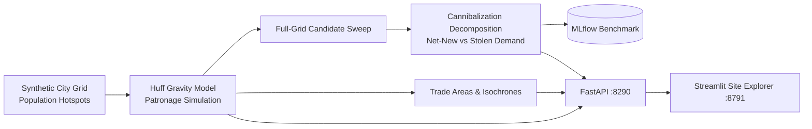

# GeoFence — Location Intelligence & Retail Site-Placement Engine

<div align="center">

[](https://www.python.org/)
[](https://fastapi.tiangolo.com/)
[](https://streamlit.io/)
[](https://mlflow.org/)
[](https://www.docker.com/)
[](https://github.com/astral-sh/ruff)
[](https://pytest.org/)
[](https://opensource.org/licenses/MIT)

</div>

> **Geospatial decision engine for retail expansion: Huff gravity-model patronage simulation, drive-time isochrones and probabilistic trade areas, full-grid candidate site search, and cannibalization-aware net-new demand optimization.**

---

## 📖 Executive Summary & Value Proposition

**`geofence`** is a production-grade, end-to-end machine learning system built with strict engineering discipline, reproducible pipelines, and enterprise MLOps best practices. It bridges the gap between theoretical statistical rigor and high-availability operational microservices.

## 📍 Core Methodologies & Spatial Modeling

### 1. Huff Gravity Patronage Model
- Probabilistic store choice for every city cell: $P(c \to s) = \dfrac{A_s^{\alpha} / d_{cs}^{\beta}}{\sum_{s'} A_{s'}^{\alpha} / d_{cs'}^{\beta}}$ with a hard distance cap.
- Demand conservation is a tested invariant: captured patronage exactly equals covered population.

### 2. Trade Areas & Drive-Time Isochrones
- Probabilistic trade areas (cells where a store's capture probability exceeds a threshold) alongside drive-time isochrone reach at average city speed.

### 3. Cannibalization-Aware Site Scoring
- Every candidate site is scored twice: raw captured demand and **net-new demand** (capture minus what it steals from the existing fleet).
- The distinction matters — measured on the planted city below, capture-greedy placement is a trap.

### 4. Honest Placement Benchmark (MLflow-logged)
On a synthetic city with a deliberately over-served downtown and underserved secondary hotspots (324 candidate sites swept):

| Strategy | Net-New Demand | Cannibalization Rate |
|---|---|---|
| Capture-greedy (naive) | 22,245 | **76.4%** |
| Net-new-aware | **35,464** | 37.8% |

**Cannibalization-aware placement finds +59.4% more net-new demand.** Fleet coverage: 92.1% of population.

## 📊 Architecture & Pipeline



## 🛠️ Tech Stack & Engineering Standards
- **Core Engine:** Python 3.12, NumPy, Pandas, SciPy stack
- **Serving & UI:** FastAPI, Streamlit + Plotly heatmaps, MLflow
- **Testing:** Pytest verification of demand conservation, cannibalization ordering, isochrone monotonicity, and API contracts


---

## 🚀 Quickstart & Setup Guide

### 1. Prerequisites & Environment Setup
Using **[uv](https://docs.astral.sh/uv/)** for lightning-fast, reproducible dependency resolution:

```bash
# Clone the repository
git clone https://github.com/jackson-marcus/geofence.git
cd geofence

# Install dependencies and pre-commit hooks
uv sync --group dev
```

### 2. Generate the City & Run the Benchmark
```bash
# Synthesize the population grid + existing store fleet
uv run python scripts/make_city.py

# Sweep all candidate sites; log naive-vs-aware benchmark to MLflow
uv run python -m geofence.models.evaluate
```

### 3. Run Test Suite & Code Quality Checks
```bash
# Run unit & integration tests with coverage
uv run pytest --cov

# Run ruff linter and formatting checks
uv run ruff check .
uv run ruff format --check .
```

### 4. Launch Services Locally
```bash
# Start FastAPI REST API (listening on port :8290)
make api
# Or: uv run uvicorn geofence.api.main:app --reload --port 8290

# Start interactive Streamlit dashboard (listening on port :8791)
make ui

# Launch local MLflow Experiment Tracking UI (listening on port :5030)
make mlflow
```

### 5. Run with Docker Compose
```bash
# Spin up the complete microservice stack
docker compose up --build
```

---

## 📂 Repository Layout

```
geofence/
├── .github/workflows/ci.yml       # GitHub Actions CI pipeline (lint, test, build)
├── configs/                      # Gravity, placement, and grid hyperparameters
├── data/                         # Data directory (processed city artifacts)
├── scripts/                      # make_city.py synthetic city generator
├── src/geofence/                 # Core Python package
│   ├── api/                      # FastAPI routes: /stores /score-site /best-sites /trade-area
│   ├── models/                   # Huff model, site sweep, placement benchmark
│   ├── ui/                       # Streamlit heatmap + site scorer application
│   └── settings.py               # Centralized configuration & environment loader
├── tests/                        # Comprehensive Pytest suite
├── docker-compose.yml            # Multi-service container orchestration
├── Dockerfile                    # Container definition for API service
├── Makefile                      # Standardized project tasks
└── pyproject.toml                # Pinned dependencies and tool configs
```

---

## 👤 Author & Contact

**Jackson Marcus**
- **Email:** [jackson.marcus.work@gmail.com](mailto:jackson.marcus.work@gmail.com)
- **Upwork:** [Jackson Marcus on Upwork](https://www.upwork.com/freelancers/~012235717501ad9c7b)
- **GitHub:** [@jackson-marcus](https://github.com/jackson-marcus)

*Available for machine learning engineering, MLOps, data science, and AI system architecture consulting and contract engagements.*
