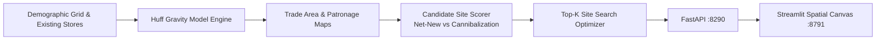

# GeoFence — Spatial Location Intelligence & Retail Site Selection

<div align="center">

[](https://www.python.org/)
[](https://fastapi.tiangolo.com/)
[](https://streamlit.io/)
[](https://mlflow.org/)
[](https://www.docker.com/)
[](https://github.com/astral-sh/ruff)
[](https://pytest.org/)
[](https://opensource.org/licenses/MIT)

</div>

> **Location intelligence and spatial analytics platform implementing the Huff Gravity Model, drive-time trade area delineation, cannibalization impact scoring, and automated optimal store placement search.**

---

## 📖 Executive Summary & Value Proposition

**`geofence`** is a production-grade, end-to-end machine learning system built with strict engineering discipline, reproducible pipelines, and enterprise MLOps best practices. It bridges the gap between theoretical statistical rigor and high-availability operational microservices.

## 🗺️ Core Methodologies & Spatial Analytics

### 1. Huff Gravity Model Formulation
- Predicts customer patronage probability from grid cell $i$ to store $j$:
$$P_{ij} = rac{S_j^lpha / D_{ij}^eta}{\sum_{k=1}^K S_k^lpha / D_{ik}^eta}$$
where $S_j$ is store square footage, $D_{ij}$ is distance, $lpha$ is size attractiveness exponent, and $eta$ is distance friction exponent.

### 2. Trade Area Isochrones & Demand Capture
- Calculates captured demand per store across geographic population grids:
$$	ext{Demand}_j = \sum_i P_{ij} \cdot 	ext{Population}_i$$
- Delineates primary (50% capture) and secondary (75% capture) trade area contours.

### 3. Cannibalization & Net-New Market Penetration
- Evaluates prospective candidate locations by measuring net-new captured demand versus revenue stolen from existing corporate branches:
$$	ext{Cannibalization Rate} = rac{\Delta 	ext{Existing Demand Lost}}{	ext{New Store Captured Demand}}$$

### 4. Automated Grid Search Placement Optimizer
- Evaluates candidate coordinate grids to recommend the top-K highest net-new revenue locations.

## 📊 Architecture & Pipeline



## 🛠️ Tech Stack & Engineering Standards
- **Spatial Analytics:** Python 3.12, NumPy, SciPy, Pandas
- **Serving & UI:** FastAPI, Streamlit, Matplotlib / Plotly Spatial
- **Testing:** Pytest verification of distance matrices, gravity probabilities, and site ranking


---

## 🚀 Quickstart & Setup Guide

### 1. Prerequisites & Environment Setup
Using **[uv](https://docs.astral.sh/uv/)** for lightning-fast, reproducible dependency resolution:

```bash
# Clone the repository
git clone https://github.com/jackson-marcus/geofence.git
cd geofence

# Install dependencies and pre-commit hooks
uv sync --group dev
```

### 2. Run Test Suite & Code Quality Checks
```bash
# Run unit & integration tests with coverage
uv run pytest --cov

# Run ruff linter and formatting checks
uv run ruff check .
uv run ruff format --check .
```

### 3. Launch Services Locally
```bash
# Start FastAPI REST API (listening on port :8290)
make api
# Or: uv run uvicorn geofence.api.main:app --reload --port 8290

# Start interactive Streamlit dashboard (listening on port :8791)
make ui

# Launch local MLflow Experiment Tracking UI (listening on port :5030)
make mlflow
```

### 4. Run with Docker Compose
```bash
# Spin up the complete microservice stack
docker compose up --build
```

---

## 📂 Repository Layout

```
geofence/
├── .github/workflows/ci.yml       # GitHub Actions CI pipeline (lint, test, build)
├── configs/                      # Configuration files and hyperparameters
├── data/                         # Data directory (raw, interim, processed)
├── scripts/                      # Data generators and operational scripts
├── src/geofence/               # Core Python package
│   ├── api/                      # FastAPI routes, schemas, and endpoints
│   ├── models/                   # Statistical models, ML algorithms, and estimators
│   ├── ui/                       # Streamlit interactive application
│   └── settings.py               # Centralized configuration & environment loader
├── tests/                        # Comprehensive Pytest suite
├── docker-compose.yml            # Multi-service container orchestration
├── Dockerfile                    # Container definition for API service
├── Makefile                      # Standardized project tasks
└── pyproject.toml                # Pinned dependencies and tool configs
```

---

## 👤 Author & Contact

**Jackson Marcus**
- **Email:** [jackson.marcus.work@gmail.com](mailto:jackson.marcus.work@gmail.com)
- **Upwork:** [Jackson Marcus on Upwork](https://www.upwork.com/freelancers/~012235717501ad9c7b)
- **GitHub:** [@jackson-marcus](https://github.com/jackson-marcus)

*Available for machine learning engineering, MLOps, data science, and AI system architecture consulting and contract engagements.*

